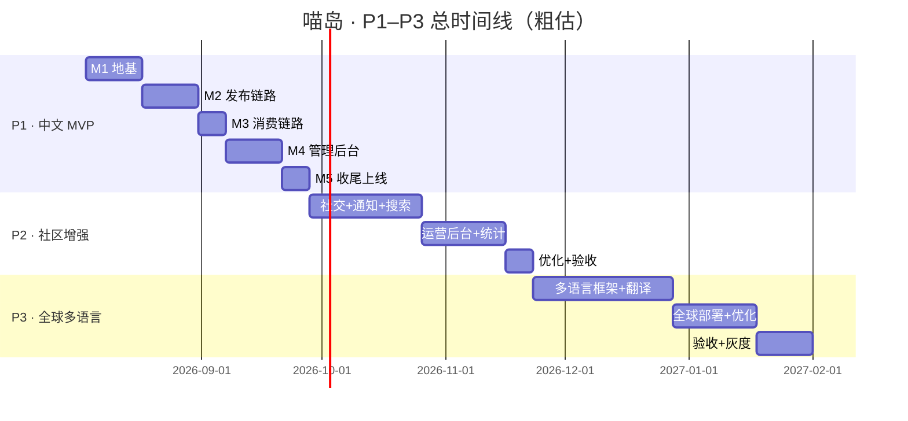

# 02 · 分阶段规划（P1–P3）

> 配套文档：《01 · 产品规划》—— 产品定位、功能清单、非功能需求
> 本文档回答：**怎么分阶段做、每阶段做什么、做到什么程度算完成。**

---

## 0. 规划总览

「喵岛」整体遵循 **「先跑通中文框架 → 再增强社区 → 最后全球化」** 的路径。

| 阶段 | 名称 | 一句话目标 | 核心交付 | 大致周期* |
|------|------|------------|----------|-----------|
| **P1** | 中文 MVP 框架 | 中文环境下「注册→发布→浏览→点赞→评论」全链路跑通，前后台可用 | 前台 App + 管理后台 + 审核流程 | 6–8 周 |
| **P2** | 社区增强 | 把「看」升级为「互动与运营」：关注、通知、搜索、举报、数据 | 社交体系 + 运营后台 + 性能优化 | 6–8 周 |
| **P3** | 全球多语言 | 全球用户看同一份内容，各自语言即时呈现 | 多语言框架 + 即时翻译 + 全球部署 | 8–10 周 |

\* 周期为 2–4 人全职开发的粗估，不含并行优化。

**贯穿三阶段的三个原则：**

1. **数据结构为多语言预留**——从 P1 建表开始，内容表就保留「原文 + 翻译缓存」的字段设计，避免 P3 大规模返工；
2. **存储与 CDN 抽象**——对象存储、媒体处理从第一天就走抽象层，P3 切换云服务零成本；
3. **纯展示、无商业**——三阶段都不引入电商、广告、付费。

---

## 1. P1 · 中文 MVP 框架

### 1.1 阶段目标

- 中文环境下，**一条完整链路可跑通**：注册登录 → 发布图文/视频 → 首页浏览 → 点赞 → 评论；
- 管理后台具备**最小审核能力**：新内容必须过审后才能公开展示；
- 上线「猫咪档案」最小版，确立垂直差异化的地基。

### 1.2 范围界定

**✅ 做（前台）**

| 模块 | 明细 |
|------|------|
| 账号体系 | 邮箱 + 密码注册/登录；JWT 会话；退出登录；修改密码；个人资料（昵称/头像/简介/封面图） |
| 内容发布 | 图文笔记（多图上传、排序、封面选择、文字描述）；视频笔记（单视频上传、封面帧、标题描述）；发布时关联/创建「猫咪档案」；基础话题标签 |
| 信息流首页 | 双列瀑布流；懒加载 + 下拉刷新；Tab：**推荐**（P1 推荐 = 最新排序）、**最新** |
| 内容详情页 | 图片轮播 / 视频播放；正文与标签；**点赞（可取消）**、**收藏（可取消）**、**一级评论** |
| 用户主页 | 头像/昵称/简介/作品数；「作品」Tab |
| 猫咪档案 | 猫咪主页（名字、品种、性别、生日、性格标签、简介）；该猫的笔记聚合页 |
| 话题 | 话题页（封面、简介、话题下内容流）；发布时选话题 |

**✅ 做（后台）**

| 模块 | 明细 |
|------|------|
| 登录 | 管理员账号登录（独立于用户端） |
| 仪表盘 | 基础数据：注册用户数、待审内容数、今日发布量、今日互动量 |
| 内容审核 | 待审/已审列表；图文与视频审核；通过/驳回（附原因）；批量操作 |
| 用户管理 | 用户列表、详情、封禁/解封 |
| 话题管理 | 话题创建、编辑、下架 |

**❌ 不做（P1 明确排除）**

- ❌ 关注/粉丝、通知中心、搜索、草稿箱、编辑删除（放 P2）
- ❌ 楼中楼评论、评论点赞、分享链接（放 P2）
- ❌ 推荐算法（先用时间排序）
- ❌ 多语言/翻译（放 P3）
- ❌ 移动端原生 App（先做响应式 Web）

### 1.3 技术架构（P1 建议）

```
┌─────────────────────────────────────────────────┐
│  前台 Web（Vue 3 + Vite + TS + TailwindCSS）      │
│  管理后台（Vue 3 + Element Plus）                 │
├─────────────────────────────────────────────────┤
│  API 网关层：NestJS（TypeScript）                │
│    · REST API · JWT 鉴权 · 参数校验 · 限流        │
├─────────────────────────────────────────────────┤
│  业务服务                                          │
│    · 用户/认证 · 内容 · 互动 · 猫咪 · 话题 · 审核  │
│    · 异步任务队列（BullMQ + Redis）               │
│      → 图片压缩/视频转码/封面帧提取（FFmpeg）       │
├─────────────────────────────────────────────────┤
│  数据层                                            │
│    · PostgreSQL（主库，含多语言预留字段）           │
│    · Redis（缓存 / 会话 / 队列）                   │
│    · MinIO 对象存储（P1 自建，接口对齐 S3）         │
│    · 本地静态文件 → 后续换 CDN                     │
├─────────────────────────────────────────────────┤
│  部署：Docker Compose（前后端 + 数据库 + 存储）     │
└─────────────────────────────────────────────────┘
```

**技术选型说明（建议，可替换）：**

| 层 | 建议 | 理由 |
|----|------|------|
| 前端 | Vue 3 + Vite + TS + TailwindCSS | 中文生态成熟、上手快、响应式适配好 |
| 管理后台 | Vue 3 + Element Plus | 中后台组件丰富，开发效率高 |
| 后端 | NestJS（TypeScript） | 工程结构规范、模块化、利于后续扩展多语言/多区域 |
| 数据库 | PostgreSQL + Redis | 关系型 + 缓存/队列，功能覆盖足够且开源 |
| 对象存储 | MinIO（S3 兼容协议） | P1 本地自建，P3 无缝切云存储 |
| 媒体处理 | FFmpeg + BullMQ 异步队列 | 视频转码、封面帧、图片压缩，不阻塞请求 |
| 部署 | Docker Compose | 单机即可跑通，P3 升级 K8s |

**数据库关键设计（为 P3 预留）：**

- 内容表：`title`（原文）、`content`（原文）、`translations`（JSONB 翻译缓存：`{ "en": {...}, "ja": {...} }`）；
- 评论表同样保留 `content` 原文 + 翻译缓存字段；
- 所有可展示文本统一收敛到「文案表」或约定字段，避免散落各处导致 P3 翻译困难；
- 品种/话题等词典类数据：中文字段 + 可扩展的 `i18n` 字段。

### 1.4 验收标准（P1 完成的定义）

- [ ] 新用户可完成：注册 → 登录 → 发布图文 → 发布视频 → 首页刷到自己的内容；
- [ ] 他人可对内容点赞/取消点赞、收藏、发表一级评论，数据即时正确；
- [ ] 新发布内容默认「待审核」，后台通过后前台可见、驳回后前台不可见且发布者可见原因；
- [ ] 猫咪档案可创建、可关联笔记，猫咪主页聚合其全部笔记；
- [ ] 桌面与移动端响应式可用（Chrome / Edge / Safari / Firefox）；
- [ ] 上传文件有类型/大小校验；密码 bcrypt 加密；接口限流；
- [ ] 无商业元素（无广告、无电商入口）。

### 1.5 里程碑拆分（P1，约 6–8 周）

| 里程碑 | 内容 | 产出 |
|--------|------|------|
| M1 · 地基（第 1–2 周） | 项目脚手架、CI 基础、数据库建模（含多语言预留）、对象存储接入、JWT 认证 | 可注册/登录的骨架 |
| M2 · 发布链路（第 2–4 周） | 图文/视频上传、媒体异步处理、笔记 CRUD、猫咪档案、话题 | 可发布内容 |
| M3 · 消费链路（第 4–5 周） | 瀑布流首页、详情页、点赞/收藏/评论 | 可浏览互动 |
| M4 · 后台（第 5–7 周） | 管理后台：仪表盘、审核、用户管理、话题管理 | 可运营 |
| M5 · 收尾（第 7–8 周） | 响应式打磨、性能基线、安全加固、部署上线 | P1 验收 |

---

## 2. P2 · 社区增强

### 2.1 阶段目标

- 把「单次浏览」升级为「长期社区」：**关注体系、通知、搜索、收藏体系**；
- 后台从「能审核」升级为「能运营」：**举报处理、数据统计、敏感词、内容管理**；
- 体验优化：草稿箱、编辑删除、评论楼中楼、推荐改为热度排序。

### 2.2 功能拆解

**前台**

| 模块 | 明细 |
|------|------|
| 关注体系 | 关注/取关用户；首页「关注」Tab；用户主页关注数/粉丝数 |
| 通知中心 | 点赞、评论、关注、系统通知；未读角标；WebSocket 实时推送 |
| 搜索 | 搜索内容 / 用户 / 话题 / 猫咪 / 品种（PostgreSQL 全文索引起步） |
| 收藏体系 | 收藏夹管理；用户主页「收藏」「喜欢」Tab |
| 评论升级 | 楼中楼（二级评论）、评论点赞 |
| 内容管理 | 草稿箱；编辑/删除自己的笔记 |
| 猫咪升级 | 按品种浏览猫咪；猫咪档案编辑 |
| 分享 | 复制链接分享 |
| 推荐 | 从「最新」升级为「热度排序」（点赞/评论/时间加权） |

**后台**

| 模块 | 明细 |
|------|------|
| 举报处理 | 举报工单列表；处理：删除内容 / 封禁用户 / 驳回举报 |
| 数据统计 | 发布趋势、热门内容、活跃用户、品类分布、图表展示 |
| 内容管理 | 已发布内容检索、下架、删除 |
| 品种管理 | 品种词典维护（新增/编辑/启用禁用） |
| 系统设置 | 公告管理、服务协议、敏感词库、审核规则配置 |
| 权限细化 | 管理员角色细分（超管 / 审核员 / 运营，仅读取权限差异） |

### 2.3 技术要点

- 通知推送：WebSocket（Socket.IO）+ 离线拉取兜底，Redis 存未读数；
- 搜索：PostgreSQL 全文检索（中文分词用 `zhparser` 或 `pg_jieba`），量级上来后再评估 ES；
- 推荐：热度分数 = 点赞/评论/时间加权，Redis 定时算分、缓存列表；
- 热榜：话题榜、猫咪榜（按互动量），定时任务刷新；
- 性能：首页瀑布流接口做「游标分页」；图片走 CDN + WebP/AVIF 自适应。

### 2.4 验收标准（P2 完成的定义）

- [ ] 用户可关注/取关，首页关注流正确展示所关注用户的新内容；
- [ ] 收到点赞/评论/关注可实时收到通知，未读角标正确，已读清除正确；
- [ ] 搜索覆盖 5 类对象且中文分词可用；
- [ ] 评论支持楼中楼与评论点赞；
- [ ] 草稿可保存/继续编辑；笔记可编辑、可删除（删除后关联内容同步处理）；
- [ ] 举报 → 处理 → 处置结果闭环可追踪；
- [ ] 敏感词命中即拦截（发布与评论均生效）；
- [ ] 首页首屏 < 2s，瀑布流滚动无卡顿（在基线机型上）。

---

## 3. P3 · 全球多语言

### 3.1 阶段目标

- **同一份内容，全球用户各看各的语言**：UI 多语言 + 内容即时翻译；
- 全球可访问：CDN 全球节点、多区域就近访问；
- 数据与运营：多语言内容管理、翻译质量管理。

### 3.2 功能拆解

| 模块 | 明细 |
|------|------|
| UI 多语言 | 前台/后台界面 i18n（至少 中/英/日，框架支持任意语言）；语言自动识别 + 手动切换 + 记忆选择 |
| 内容即时翻译 | 笔记标题/正文/评论按需翻译：用户点击「翻译」触发，或默认自动翻译；翻译结果缓存（DB JSONB + Redis），命中缓存零延迟 |
| 翻译引擎抽象 | 对接翻译服务（可选 Google / DeepL / 本地模型），**接口抽象**，可切换、可降级；P3 先做中英，验证后放开全部语言 |
| 翻译质量管理 | 后台可查看翻译缓存、手动修正、一键重译；原文变更后标记「待重译」 |
| 全球部署 | 对象存储切云 + CDN 全球节点；静态资源加速；API 多区域就近（起步可 CDN 前置） |
| 搜索国际化 | 搜索索引支持多语言（词典/内容双语言检索） |
| 合规 | GDPR 意识（隐私政策多语言化）、各国内容审核规则差异评估 |

### 3.3 技术要点

- **翻译流程（核心）**：

```
用户浏览内容（语言 L）
   │
   ├─ 命中翻译缓存（translations[L]）→ 直接返回 ✅ 零延迟
   │
   └─ 未命中 → 请求进入翻译队列（BullMQ）
         → 调翻译引擎 → 写回 translations[L] 缓存 → 返回结果
         （异步批量 + 限流，避免请求阻塞；源语言内容可先展示原文兜底）
```

- 语言识别：`Accept-Language` + IP 区域 + 用户手动选择，优先级：手动 > 历史 > 浏览器 > IP；
- 原文变更策略：发布/编辑时**只写原文**，翻译一律异步生成，保证主流程不被翻译拖慢；
- 多语言检索：内容建 `tsvector` 多列（原文 + 已翻译语种），或 P3 视量级引入 ES；
- 监控：翻译失败率、翻译队列积压、各语种缓存命中率看板。

### 3.4 验收标准（P3 完成的定义）

- [ ] 切换语言后，**UI 全部**切换为目标语言；
- [ ] 同一篇笔记，中/英/日用户看到各自语言；未翻译完成时优雅回退原文并提示；
- [ ] 翻译缓存命中时，详情页无额外延迟；新内容翻译在可接受时间内（如 < 1 分钟）完成；
- [ ] 后台可查看/修正/重译翻译内容；
- [ ] 全球主要区域访问流畅（CDN 生效）；对象存储完成云迁移，P1 抽象层无返工；
- [ ] 搜索支持至少中/英双语结果。

---

## 4. 横切关注点（贯穿三阶段）

| 关注点 | P1 | P2 | P3 |
|--------|----|----|----|
| **数据建模** | 建表即预留多语言字段 | 词典数据补 i18n | 翻译缓存正式启用 |
| **安全** | 密码加密、JWT、上传校验、限流 | 敏感词、举报、权限细分 | GDPR 合规、隐私政策多语言 |
| **性能** | 首屏 < 2s、懒加载 | 游标分页、CDN、热榜缓存 | 全球 CDN、多区域 |
| **可观测** | 基础日志、错误上报 | 结构化日志、指标采集 | 翻译监控看板、SLO |
| **测试** | 核心链路 E2E | 互动/通知 E2E、性能基线 | 多语言回归、跨区域演练 |

---

## 5. 里程碑总时间线



---

## 6. 风险与应对

| 风险 | 影响 | 应对 |
|------|------|------|
| 视频处理拖慢发布 | 发布体验差 | 异步队列 + 转码后回填；P1 先支持短视频（如 ≤ 2 分钟） |
| 内容审核人力不足 | 违规内容漏审 | 先审后发兜底 + 举报机制；P2 敏感词自动拦截 |
| 中文分词检索效果差 | 搜索体验差 | P2 用 pg_jieba 起步，量级上来再评估 ES |
| P3 翻译成本与延迟 | 多语言体验差 | 翻译缓存 + 异步批量 + 引擎可降级；原文兜底 |
| 对象存储/云迁移返工 | P3 延期 | P1 即用 S3 兼容抽象，禁止直接依赖 MinIO 私有 API |
| 多语言返工 | P3 大改 | P1 建表即预留 translations 字段，杜绝「后补」 |

---

## 7. 团队与分工建议（2–4 人）

| 角色 | 职责 |
|------|------|
| 前端工程师 | 前台 Web + 管理后台 |
| 后端工程师 | API、数据库、媒体处理、队列 |
| 运维/全栈 | Docker、部署、CDN、CI |
| 产品/设计（可兼任） | 交互稿、审核规则、话题/品种词典、运营文案 |

> 若只有 1 人全栈：按里程碑顺序推进，M1→M3 优先（前台全链路），M4 后台可简化先做「审核」一项。

---

## 8. 下一步行动（P1 开工清单）

1. [ ] 敲定技术选型（前端/后端/数据库/存储），冻结后不再更换；
2. [ ] 输出数据库建模初稿（重点：**多语言预留字段**设计评审）；
3. [ ] 确定媒体处理方案（上传限制、转码规格、封面帧策略）；
4. [ ] 明确审核规则与「先审后发」流程细节；
5. [ ] 搭好项目脚手架 + CI + Docker Compose；
6. [ ] 进入 P1 · M1 里程碑。
