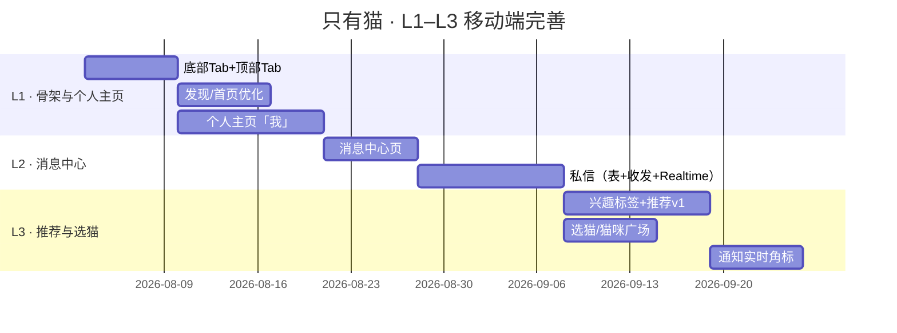

# 04 · L1-L3 移动端功能完善计划

> 配套文档：《01 · 产品规划》《02 · 分阶段规划 P1-P3》
> 背景：主站（P1 + P2-M6）已稳定上线。本阶段聚焦**移动端（App）体验**：
> 重构为「上三下五」导航结构，并补齐个人主页、消息中心（含私信）、个性化推荐、选猫。
> 命名 **L1–L3** 与之前的 P 阶段区分（L = 移动端体验线）。

---

## 0. 目标导航架构（App 骨架）

```
┌──────────────────────────────────────┐
│  顶部 Tab：  关注  ·  发现  ·  选猫     │  ← 首页内容流顶部的分段控件
├──────────────────────────────────────┤
│              内容区域                  │
├──────────────────────────────────────┤
│  🏠首页 │ 🐱猫咪 │ ➕ │ 💬消息 │ 👤我  │  ← 底部固定 Tab 栏
└──────────────────────────────────────┘
```

**说明**
- **顶部 Tab**（页面内分段控件，随内容区滚动，仅首页/猫咪流展示）：
  - `关注`：我关注的人的实时内容流
  - `发现`：个性化推荐流（**首页默认**）
  - `选猫`：猫咪浏览（发现猫）
- **底部 Tab**（全局固定导航栏，**桌面端与移动端统一显示**）：
  - `首页` = 发现（同一个推荐信息流，底部快捷入口）
  - `猫咪` = 选猫（**同一个猫咪广场页**，顶部「选猫」与底部「猫咪」共用 `/cats`）
  - `＋` = 发布（图文 / 视频，居中突出按钮）
  - `消息` = 消息中心（私信 / 评论回复 / 点赞 / 关注 / 系统，带未读角标）
  - `我` = 个人主页（本人）

**桌面端布局**：底部 Tab 栏两端统一显示；桌面端额外保留现有顶部 Navbar（搜索/通知/用户菜单等入口）。

**路由映射**
| 路由 | 页面 | 归属 |
|------|------|------|
| `/` | 发现流（顶部 Tab：关注/发现/选猫） | 首页 |
| `/cats` | 选猫 / 猫咪广场 | 顶部选猫 + 底部猫咪 |
| `/publish` | 发布 | 底部 ＋ |
| `/messages` | 消息中心 | 底部 消息 |
| `/profile/[username]` | 个人主页 | 底部 我 |

---

## 1. L1 · 导航骨架 + 首页/发布/个人主页完善

> 目标：移动端骨架成型，首页与「我」闭环可用。**约 2–3 周**

### 1.1 导航重构（骨架）
- [ ] 新增**底部 Tab 栏**组件（首页/猫咪/＋/消息/我），**桌面端与移动端统一显示**；桌面端保留顶部 Navbar（搜索/通知/用户菜单）
- [ ] 首页改造为「**关注 / 发现 / 选猫**」顶部分段 Tab（复用现有 HomeTabs 扩展）
- [ ] 底部 Tab 未读角标：消息数（私信+未读通知）
- [ ] 路由高亮联动（usePathname），＋ 按钮居中凸起

### 1.2 发现 / 首页
- [ ] L1 基线保持**热度排序**（hot_score，M5 已完成）
- [ ] 首屏加载优化 + 骨架屏（瀑布流已有，增强加载态）
- [ ] 移动端瀑布流体验微调（L 阶段已完成，保持）

### 1.3 发布（＋）
- [ ] 现有 `/publish` 移动端体验优化：全屏布局、拍照/相册入口
- [ ] 发布结果引导（进审核提示 / 去「我的」查看）

### 1.4 个人主页「我」
- [ ] **CATSJUST ID**：`@username` 强化展示 + 一键复制
- [ ] 统计区升级（**数字可点击跳列表**）：作品 / 关注 / 粉丝 / 获赞 / 收藏
- [ ] **关注列表页** `/profile/[username]/following`：头像/昵称/关注按钮，点进对方主页
- [ ] **粉丝列表页** `/profile/[username]/followers`：同上
- [ ] 内容 Tab 完善：作品（本人可**编辑/删除**）/ 收藏 / 赞过 / **评论**（新增：我发过的评论）
- [ ] 我的猫咪 Tab：本人创建的猫咪档案（可编辑）
- [ ] 编辑资料入口（已有 `/settings`，补 CATSJUST ID 展示）

---

## 2. L2 · 消息中心（含私信）

> 目标：消息闭环可用，私信从零实现。**约 2–3 周**

### 2.1 消息中心页 `/messages`
- [ ] 聚合页：**私信 / 评论回复 / 点赞 / 关注 / 系统** 五个分组
- [ ] 未读角标 + 打开即已读
- [ ] **评论回复通知**：楼中楼回复也通知被回复者（当前触发器只通知笔记作者，需扩展 `notify_on_comment` 支持 `parent_id` 作者）

### 2.2 私信（新增，从零）
- [ ] **数据表**：`conversations`（会话）+ `messages`（消息）
  - conversations：`id, user_a, user_b, last_message_at, last_preview, unread_a, unread_b`
  - messages：`id, conversation_id, sender_id, content, created_at, read`
- [ ] **RLS**：仅会话双方可读/可写；封禁用户不可收/发
- [ ] 会话列表页：头像/昵称/最后一条消息/未读数/时间
- [ ] 聊天详情页：气泡、时间线、发送；输入框回车发送
- [ ] 触发入口：对方主页「发私信」按钮；无会话自动创建
- [ ] 敏感词校验复用（`has_sensitive_word`）
- [ ] 实时性：**L2 直接接入 Supabase Realtime**（消息即时到达 + 会话列表实时刷新）

### 2.3 通知增强
- [ ] 通知按类型分组展示（评论回复/点赞/关注/系统）
- [ ] 通知跳转正确（点通知进对应笔记/主页）

---

## 3. L3 · 个性化推荐 + 选猫 + 实时

> 目标：发现流个性化、猫咪生态完整、消息实时。**约 3–4 周**

### 3.1 个性化推荐（发现）
- [ ] **兴趣标签体系**：`profile_interests` 表（用户选兴趣：品种/话题偏好）
- [ ] 兴趣收集**两者都要**：注册流程插入一步可选兴趣（可跳过）+「设置」里随时修改
- [ ] 推荐算法 v1（SQL RPC）：`hot_score × 兴趣匹配权重 × 关注流优先`
- [ ] 「不感兴趣」反馈（简单版：记录后降权）

### 3.2 选猫 / 猫咪（同一个 `/cats` 猫咪广场）
- [ ] **猫咪广场** `/cats`：按品种分类浏览 + 热门猫咪榜 + 猫咪搜索
- [ ] 猫咪档案编辑（本人可改：头像/名字/品种/生日/性格/简介）
- [ ] 我的猫咪管理（创建 / 编辑 / 下架）

### 3.3 实时能力
- [ ] Supabase Realtime 扩展：**通知实时角标**（私信实时已在 L2 完成）
- [ ] 消息已读回执（对方已读状态）

### 3.4 运营与数据
- [ ] 后台补充：私信量 / 消息量统计、兴趣标签分布
- [ ] 推荐数据看板（曝光/点击/不感兴趣）

---

## 4. 横切关注点

| 关注点 | L1 | L2 | L3 |
|--------|----|----|----|
| 性能 | 底部 Tab 切换不重建、首屏骨架 | 会话/消息列表虚拟滚动 | 实时消息增量更新 |
| 安全 | —— | 私信 RLS 严格、敏感词校验、封禁用户拦截 | 私信举报（后续） |
| 多语言 | 新增词条按 i18n 框架维护（仅保证 zh-Hans，其余批量补翻） | 同左 | 同左 |
| 测试 | 关注流/发布/个人主页 E2E | 私信收发 E2E | 推荐/实时回归 |
| 数据 | 统计区接口（获赞/收藏数） | 消息未读数 | 兴趣标签数据 |

---

## 5. 里程碑时间线



---

## 6. 建议实现顺序与依赖

1. **L1 先行**（骨架 + 个人主页）：个人主页列表页依赖 follows 表（已有），无新建表，收益最快
2. **L2 私信**：需新建 2 张表（conversations/messages）+ 迁移 + 启用 Supabase Realtime，是独立模块，可与 L1 并行
3. **L3 个性化**：依赖兴趣标签表 + 推荐 RPC，放最后
4. 每条完成后本地验收 + 部署，与 P 阶段节奏一致

## 7. 已确认的设计决策（2026-08-02）

| 决策点 | 结论 |
|--------|------|
| 顶部「选猫」与底部「猫咪」 | **同一个页面**（`/cats` 猫咪广场） |
| 桌面端导航 | **两端统一**：桌面与移动端都显示底部 Tab 栏，桌面保留顶部 Navbar 作补充入口 |
| 私信实时性 | **L2 直接上 Supabase Realtime**（不先做轮询） |
| 兴趣标签收集 | **两者都要**：注册时一步可选 + 设置中随时修改 |
